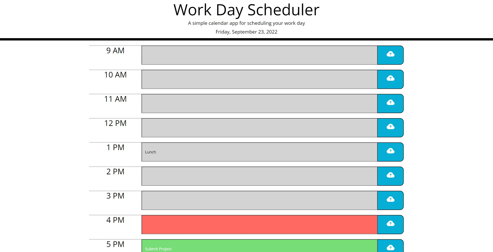

# Work Day Planner

## Description

### **This repository includes all files of my Work-Day Planner**

This work-day planner is designed to help users organize their their activities throughout the day. For ease-of-use, time blocks are automatically color coded to represent if it's corresponding time of day has already passed, is upcoming, or the present time of day. Moreover, any entries for a timeblock's input field will persist through refresh and closure of application once it's save button is clicked.

### Developing the Application

This biggest motivation for me to create this app was to learn about persistent data and Javascript optimization by use of use of JQuery. For the latter point, JQuery's object methods were deeply useful in applying quick dom manipulations and attribute data collection.

Lastly, MomentJs was utilized for time functionality. MomentJs' extensive library of time formatting and current time behavior was extremely easy to use and its wide breadth of options made it very accessible with my application goals.

### Future Development of this Application

One feature that will be added in a future update is automatic deletion of previous day entries.

---
## Deployed Page link

https://toacin.github.io/Work-Day-Planner/

## Installation

N/A (Please see above for deployed link.) Once on deployed page, begin adding entries and saving to see application in action!

## Credits

Special thanks to the UofA Coding Bootcamp teaching staff for guidance and assistance.

## License

Open Source

---
## Images of Application

### Application Image
